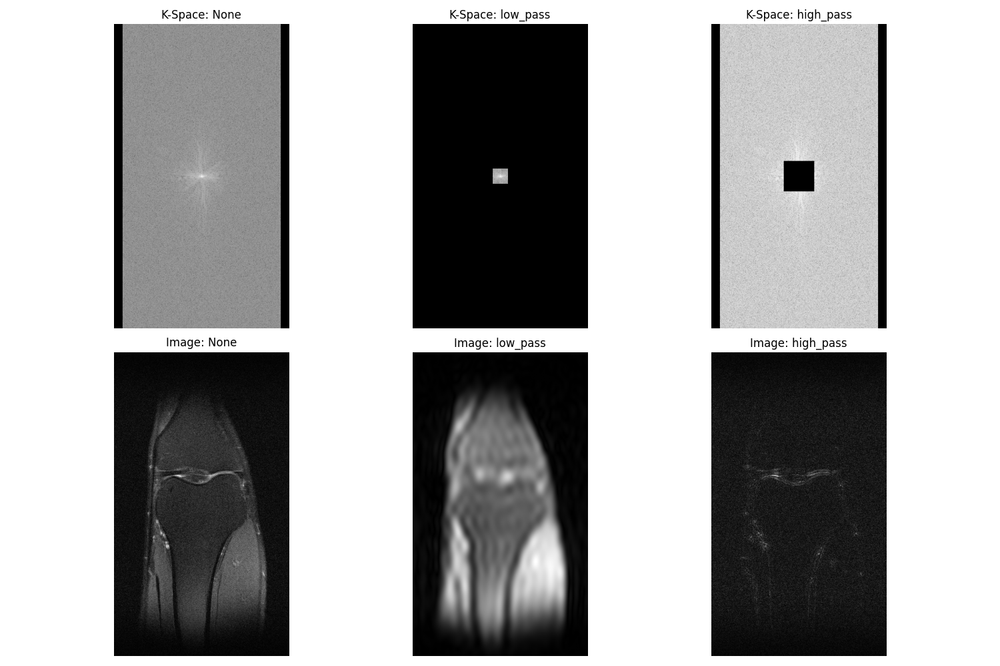

# Diff-Recon: Zero-Shot MRI Reconstruction

## Project Goal
Building a **Score-Based Diffusion Model** to reconstruct high-fidelity MRI images from undersampled k-space data using Langevin Dynamics.

## Phase 1: Data Mastery & Fourier Fundamentals

The goal of this phase was to build a robust data pipeline to handle raw MRI k-space data and verify the relationship between frequency sampling and image reconstruction quality.

### Visualization: K-Space vs. Image Domain
Below is a comparison of how different frequency-domain masks affect the spatial reconstruction of a knee MRI slice.

#### Key Insights:
* **Full Reconstruction (None):** Utilizes the complete k-space. Note the vertical black bars in the k-space; these represent **oversampling** in the readout direction, a standard technique to prevent aliasing artifacts.
* **Low-Pass Filter:** By keeping only the central 10% of k-space (the low frequencies), we retain tissue contrast and general shapes but lose sharp edges, resulting in a **blurry** image.
* **High-Pass Filter:** By zeroing out the center and keeping the periphery, we retain only the sharp transitions and anatomical boundaries, creating an **edge-map** (or "sketch") of the knee.

> **Engineering Note:** Initial tests on the `knee_singlecoil_test` dataset showed significant blurriness even in "Full Reconstruction." This was identified as intentional undersampling in the test set. Switching to `knee_singlecoil_val` provided the ground-truth data required to verify the Fourier Transform logic.

## 🛠️ How to Run
1. **Install Dependencies:** `pip install -r requirements.txt`
2. **Generate Visualizations:** Run `python src/visualize_results.py` to recreate the k-space comparison grid in the `/outputs` folder.

## 🌊 Phase 2: Forward Diffusion Process
Implemented a **Gaussian Variance Scheduler** ($T=1000$) to model image degradation. Using the reparameterization trick, the system can sample a noisy image $x_t$ at any arbitrary timestep directly from the ground truth $x_0$, which is essential for efficient training of the score-based model.

**Mathematical Foundation:** $x_t = \sqrt{\bar{\alpha}_t}x_0 + \sqrt{1 - \bar{\alpha}_t}\epsilon, \quad \epsilon \sim \mathcal{N}(0, \mathbf{I})$